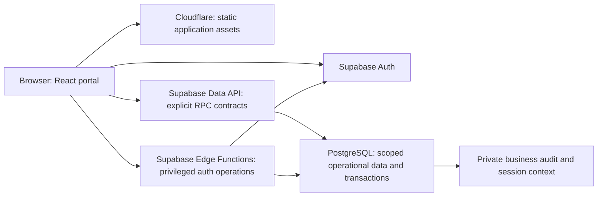

# PrimeCampus — Technical Requirements Document

Version: 1.0
Date: 5 October 2026
Release: V1, first-school deployment
Product authority: PrimeCampus_PRD.md, version 1.2
Status: implementation specification; no application, migrations or deployment have been performed by writing this document.

## 1. Purpose, authority and remaining inputs

This document specifies how to implement the agreed school workflows. The PRD controls product scope and role rights. This TRD controls architecture, technical defaults, integration boundaries and validation. Earlier research/design documents are reference material and do not override either.

There are enough product decisions to write this document without another broad discovery round. Engineering choices below are CTO defaults made for implementation, not claims that the founder explicitly selected each library, retention interval or physical table layout. The detailed database document follows next and must implement these contracts. Any material departure requires updating this document before different agents build incompatible implementations.

Remaining deployment inputs are actual Supabase/Cloudflare project identifiers, the controlled authentication-alias domain, the school's working days/period schedules, anonymized spreadsheet samples and the verified applicable UDISE+ field dictionary. These do not block this TRD. They must be supplied/verified before their respective production configurations/imports. Do not fabricate UDISE fields or claim government integration.

## 2. Scope and technical constraints

- Multi-tenant architecture: organization -> one or more separately scoped schools.
- First customer: approximately 800 students at one school. Working-day, section and staff counts in sizing are illustrative until the school's configuration is known.
- Online-only responsive browser application; English interface. Names/notes remain Unicode-capable even though interface labels are English.
- Text/data records only. No stored photos, logos, scanned documents or homework attachments. Spreadsheet imports are temporary processing inputs. Receipts/exports are generated from stored records on demand.
- Supabase Auth selected; school-issued username/password experience; users need no personal inbox.
- Start within free hosting/backend allowances. Continued free operation is a target to measure, not a guarantee or a reason to discard required history.
- Both daily and period student attendance, configurable per school with effective dates. Separate staff calendars and attendance.
- Manual verified collections and cheque lifecycle; no payment gateway, payouts, credit wallet or approval queue.
- Exams, notifications/WhatsApp/voice, biometrics, library, transport/GPS and statutory payroll remain deferred as in the PRD.
- Automated backups and restore tooling remain deferred by the founder. Data exports do not constitute a tested restore facility.
- No requirement for microservices, a separate always-on server or search indexing infrastructure in V1.

## 3. Stack decisions

| Layer | Selected technology | Reason/boundary |
|---|---|---|
| Application | React + TypeScript + Vite | Logged-in, interactive ERP with a static frontend build |
| Routing | React Router, client-side data-router mode | Nested layouts, route boundaries and lazy route modules; server rendering is unnecessary for V1 |
| Query/cache | TanStack Query | Explicit scoped reads, mutation invalidation and retry behavior |
| Forms/validation | React Hook Form + Zod | Consistent input contracts and field errors; server validation remains authoritative |
| UI primitives | Tailwind CSS + selected shadcn/ui components | Shared accessible controls, dialogs and form/table conventions |
| Database | Supabase PostgreSQL | Relational integrity, transactions, school isolation and reports |
| Authentication | Supabase Auth | Password/session management; username adapter described below |
| Server functions | Supabase Edge Functions using TypeScript | Authentication administration and operations requiring backend secrets |
| Browser backend client | supabase-js | Auth and typed RPC access; no administrative credentials |
| Frontend hosting | Cloudflare Workers Static Assets | Deploy Vite's built assets with SPA navigation support |
| Spreadsheet handling | Lazy-loaded ExcelJS for XLSX; a maintained CSV parser | Temporary browser-side parsing and export; server revalidates mutations |
| Testing | Vitest, React Testing Library, Playwright and PostgreSQL integration checks | Business rules, permission bypass attempts, UI workflows and concurrency |

Use one package manager and commit its lockfile; npm is the default. At repository initialization, resolve compatible supported stable versions, pin them and record the tested Node LTS and Edge runtime requirements. Do not independently install different major versions in each agent branch. Do not choose prerelease dependencies for routine functionality. Check dependency maintenance/security before locking the spreadsheet packages.

Next.js, Clerk, Redis, an ORM-generated schema and a Cloudflare-hosted database are not part of this implementation. PostgreSQL migrations are the database source of truth; generated TypeScript types must follow them. Cloudflare serves the application; Supabase serves authentication/data. Keep a single backend authority for the school records.

Relevant official setup references: [React Router](https://reactrouter.com/start/data/installation), [shadcn/Vite](https://ui.shadcn.com/docs/installation/vite), [Zod](https://zod.dev/) and [ExcelJS](https://github.com/exceljs/exceljs).

## 4. Architecture and request paths



The diagram shows responsibility; the browser normally downloads assets once and then calls Supabase directly. Do not route every data query through Cloudflare merely to use a server endpoint. Cloudflare does not cache private school records publicly.

Use an RPC-first application API: feature code calls named database operations through a typed repository layer. Read operations return role-appropriate projections, not unrestricted table objects. Writes involving money, placement, attendance, leads or membership use explicit validated operations. Do not implement a generic arbitrary-table CRUD endpoint.

Ordinary database operations run with the user's authenticated identity. Edge Functions use the caller's verified identity for authorization and only use an administrative Auth client when the operation genuinely requires it. A browser-supplied school, role, child, actor or amount is input to validate, not trusted authority.

Core tables live in a non-exposed application schema. Private account/security/audit tables live in a separate private schema. A small exposed API schema (default: public) contains named RPC entry points and any explicitly approved safe views. Configure actual Data API schema exposure and GRANTs; do not assume table creation automatically exposes the API. No sensitive core/audit table is added to exposed schemas for convenience.

Default database routines are SECURITY INVOKER. Any necessary SECURITY DEFINER implementation belongs in a private schema, has a fixed/empty search_path with qualified names, revokes default PUBLIC execution, grants execution narrowly and explicitly checks identity/session/context/target scope. Exposed entry points are thin invoker wrappers. Definer routines must not rely on RLS that their owner can bypass. Do not add a generic privileged helper that accepts arbitrary SQL or arbitrary table names.

RLS is mandatory for exposed tables and defense in depth for core/private data. Enable appropriate policies/grants before adding an endpoint. Use security_invoker views when a view should obey caller permissions. See [Supabase RLS](https://supabase.com/docs/guides/database/postgres/row-level-security) and [database functions](https://supabase.com/docs/guides/database/functions).

## 5. Repository and shared contracts

One repository, one frontend build and one migration history:

```text
src/
  app/                   application bootstrap, routing and layouts
  components/ui/         shared UI primitives
  components/shared/     context switcher, tables, form/error wrappers
  features/
    auth/ operator/ setup/ students/ imports/ admissions/
    timetable/ attendance/ diary/ homework/ fees/ staff/ reports/
  lib/                   Supabase client, repositories, dates, money, telemetry
  contracts/             DTO validation, errors, capabilities, query keys
  generated/             database types generated from migrations
supabase/
  migrations/            ordered, reviewed migrations
  functions/             server functions with shared authorization helpers
tests/                   business, database/RLS, integration and browser tests
docs/                    approved specifications and decision records
```

This is a future repository layout, not a statement that these directories exist already. Keep the current planning documents accessible in the eventual docs directory.

Shared contracts must freeze before parallel feature implementation: identifier types, dates, money, active context, role/capability identifiers, DTO names, API errors, operation/request IDs, attendance/homework codes and repository interfaces. No feature agent edits these casually.

Components do not issue ad hoc database queries. A repository method performs one use case with explicit fields and filters. Generated database types are not automatically the same as public DTOs: bank details and sensitive identifiers must not enter a general student/staff DTO.

## 6. Identity, usernames and recovery

### 6.1 Account model

One global application account links to one Supabase Auth UUID. Memberships grant roles at particular organizations/schools. Separate student, guardian and staff records link to the account when appropriate; a staff or guardian record can exist without a login. Phone number/name similarity never automatically merges identities.

Default login identifier: globally unique, case-insensitive school-issued username. Include a school prefix when provisioning, so two schools can each issue local numbers without global collisions. Store a canonical lowercase form and enforce uniqueness. Permit a bounded ASCII identifier suitable for an email local part; human names remain separate display fields. Keep usernames stable during ordinary profile edits.

The browser sign-in module derives an internal email alias from the canonical username and a configured controlled domain, then calls Supabase's ordinary password sign-in using that alias. This is an application adapter, not native Supabase username authentication. Example pattern: issued-username@login.<owned-domain>. The actual domain is deployment configuration, not a domain to invent or register during documentation.

An internal alias is an identifier, not a real inbox. Do not implement catch-all mailbox infrastructure or email recovery to nonexistent addresses. Disable public signup; provision confirmed accounts through the authorized server flow. The browser does not hash/store/verify passwords itself; Supabase Auth performs the password operation. The alias formula being visible does not grant access without the user's password. Generic errors must not reveal whether unrelated usernames exist. No public endpoint returns a username/email mapping directory.

After a successful provider sign-in, bootstrap_account validates the authenticated user and creates or updates the application session/context record before returning any operational data. Apply provider/application abuse limits to sign-in behavior and test burst school login behavior. Edge Functions require a verified user/session/context before any administrative client call. A provider session alone cannot open operational data: all operational routines require a live validated application session and scope. Do not expose a caller-controlled routine that creates a trusted application session for another user/session.

Supabase supports email/phone password identities; account administration is server-only. References: [password authentication](https://supabase.com/docs/guides/auth/passwords), [admin createUser](https://supabase.com/docs/reference/javascript/auth-admin-createuser).

### 6.2 Provisioning

Admin provisions accounts in their assigned schools; Operator provisions platform/school accounts. Admin cannot assign Operator or access an unrelated school's user directory. Staff category such as sports staff does not imply a new login role. Owner/Principal remain read-only operational roles even when they hold multiple memberships.

Provisioning is a resumable server operation with an operation ID: validate requested memberships, reserve username, create/find the intended Auth identity, link the application person and activate memberships, then return completion. Auth administration and a PostgreSQL transaction are separate systems; do not claim one atomic transaction covers both. Partial failure leaves an explicitly pending/disabled account with no school data access. Retry resumes or repairs the same operation instead of making a second identity.

Generate strong random temporary credentials server-side. Show them once to the authorized issuer for external delivery; do not retain plaintext credentials in database rows, console logs, analytics or export files. No automatic SMS/email delivery is included.

Linking an existing global account requires explicit identity verification. Cross-organization account linking/recovery is Operator-mediated by default to prevent an Admin from taking control of an unrelated school's account.

### 6.3 Recovery and forced change

V1 recovery is school-office/Operator-assisted. Admin can reset only an account whose active school memberships all fall within that Admin's authorized scope. Otherwise Operator handles the global password reset. Disabling a school membership remains local and does not disable unrelated memberships.

Temporary-password accounts have a server-owned must_change_password flag. Before clearing it, permit only account bootstrap/logout and the password-change operation, not operational data. The server clears the flag only after a verified successful Auth password change; a frontend checkbox or editable user_metadata is insufficient. A password-change partial failure has an explicit retry/support state.

Password reset/global disable revokes provider sessions and application sessions. Check current account/membership/session state on requests so old access tokens do not continue providing school access simply because their signature remains valid. Use Supabase's supported session semantics rather than assuming deleting a user or signing out instantly makes every JWT unusable. [Session documentation](https://supabase.com/docs/guides/auth/sessions)

## 7. Active context and authorization

### 7.1 Server-held context

An application session is tied to the verified JWT user ID and session_id. Server-owned state holds selected school, selected role/membership, optional selected child, context revision and revoked/credential-change state. Never authorize from editable user_metadata or role/school values stored only in browser storage.

Bootstrap returns only the caller's available memberships and linked child cards. Context selection validates those choices and increments the context revision. All operational RPCs require that revision and reject stale contexts before reading or writing data. The frontend clears caches and cancels pending requests when switching; old responses cannot populate the new view.

For V1, browser tabs sharing the same Auth session share its selected context. Broadcast role/school/child changes and logout across tabs, clear stale data and show a context-change message. Different roles in two tabs are not silently treated as independent sessions. Separate devices/sessions may select different valid contexts.

An Operator selects an explicit target school/role-view for support, but the true actor remains Operator. Acting as a teacher-looking interface does not impersonate that teacher in history. Operator-only consoles require the real platform grant. No default school fallback when the supplied record belongs elsewhere.

### 7.2 Capability rules

| Role | Server-enforced scope |
|---|---|
| Operator | All organizations/schools; raw logs; support operations; actual actor retained |
| Admin | All operational functions in granted schools; confidential staff data; no raw log console |
| Accountant | Fee configuration, concessions, demands, collections, reversals and reports; limited student identification; no salary/bank employee data |
| Principal | Academic/timetable/student and staff attendance/diary/homework reads; no writes or confidential staff finance |
| Owner | Fee and staff-finance reads, attendance summaries; no academic diary/homework detail or operational writes |
| Teacher | Effective assigned sections/subjects, class-teacher duty and dated substitutions; authorized attendance/diary/checking; no fee administration or salaries |
| Parent | Only linked children and permitted fields; read-only operationally |
| Student | Own linked student data and permitted fields; read-only operationally |

Selected context must restrict the active interface/API; do not union Teacher and Parent grants and expose teacher records while in Parent context. Child selection also restricts responses to that child. Teacher permissions are dated and subject/session-aware. Admin admissions delegation is an explicit capability within an existing role; no new role is introduced.

Sensitive student reporting identifiers/income fields are separated from ordinary teaching DTOs. Employee salary/bank data resides in separately restricted relations. Owners receive attendance-summary operations rather than unrestricted attendance rows. Aggregate/report/export operations recheck scope; totals must not leak records hidden on detail pages.

### 7.3 Required policy coverage

The database document must list SELECT/INSERT/UPDATE/DELETE or explicit denial for every relation. UPDATE rules constrain both old and new scope; changing school_id cannot move a record into another tenant. Security-context helper lookups must avoid recursive RLS dependencies and use indexed lookups. Private audit INSERT is system/business-operation controlled; user/browser clients cannot forge trusted events.

Each core school reference must be validated by tenant-aware keys/foreign keys, not just by attaching school_id to the top row. A fee allocation must reference an invoice of the same school/student; a lesson must reference that school's year/section/subject; guardian links must not silently cross customers. Cross-school sibling accounts use valid separate links/memberships, not cross-school entity references without authorization.

## 8. Database conventions and history

- Auth UUID remains Supabase's stable identity. Use UUIDs for principal business entities; use compact numeric surrogate IDs for high-volume submission/audit internals where appropriate. Do not stringify numeric IDs unsafely beyond JavaScript's safe integer range.
- Store business dates as date values and instants as timestamptz. School business zone defaults to Asia/Kolkata. Render instants locally without shifting attendance dates via UTC conversion.
- Store school/student numbers as strings with scoped uniqueness; names and roll numbers are not primary keys.
- Money uses integer paise with server-side exact arithmetic. JSON money is an integer only within the enforced safe bound. Percentage concessions use bounded fixed precision/basis points; round at documented line boundaries and then sum. No floating-point fee/salary arithmetic.
- Status fields use explicit constrained codes. Missing price differs from zero; unmarked attendance differs from absent; unchecked homework differs from not completed.
- Version mutable records. Save/create timestamps and authors are server-issued; retain observation/check dates separately where relevant.
- Preserve history by effective-dated relationships and immutable posted financial snapshots. Do not introduce whole-record version copies for every checkbox change.
- Retire referenced configuration rather than cascade-delete attendance/fees. Scope deletion/archival deliberately. Hard deletion of a draft does not permit deleting a issued receipt or posted collection.
- Index actual query paths: school/year/date, student/date, section/date, effective teaching assignments, guardian/student links, invoice dues, external-reference uniqueness and audit school/time. Explain the purpose of each large index; do not add a separate index for every checkbox/status column.

The detailed schema must enumerate tables, field types, constraints, indexes, API projections, RLS, routines and migration order. This TRD names logical entities/contracts without pretending the final table list has been created.

## 9. Academic model and schedule resolution

Academic years belong to schools; at most one current default. Student enrollment/year and dated placement are separate from the permanent profile. Class/subject masters may be reused, but section/year offerings and teaching responsibility are year-scoped. Avoid accidentally reusing last year's roll/section membership.

Student and staff/group calendars are independent. Resolve an explicit dated calendar outcome with working weight, applicable period schedule and labels. Special/exam labels do not inherently cancel attendance. A half-day uses the selected reduced schedule. Materialize or persist resolved dates where history depends on them; define rule precedence as dated override > group/weekday pattern > school defaults, separately for each audience.

Timetable versions have effective intervals. Actual dated lesson sessions resolve calendar, weekly plan and overrides. Persist stable session/slot identities once used by attendance/diary/homework. Future sessions can be generated idempotently for a bounded date range; do not pre-generate several years or every student's copy of each lesson.

Teacher conflicts use actual start/end intervals with start-inclusive/end-exclusive comparisons. Two adjacent lessons are allowed; overlapping lessons/substitutions are flagged. Admin may record a deliberate exceptional overlap with a reason as the PRD permits. Availability distinguishes confirmed present, absent and attendance not yet marked; unknown is not confirmed free/present.

Substitution suggestions read overlapping assignments and staff attendance. Admin commits/replaces a dated assignment with actor/time/reason, then the server recalculates applicable access. Preserve planned versus actual teacher. Missing diary is not evidence that a lesson was cancelled; cancellation is explicit and excludes attendance eligibility.

Placement moves are effective on a local date boundary in V1; intraday splitting is deferred. Preview roll conflicts, future lesson/homework eligibility and fee implications, then commit atomically. Preserve earlier placement/session history. Retroactive corrections require impact preview and explicit reconciliation, not silent relocation of old rows. New-year placement is manual/imported; no automatic promotion.

## 10. Compact student attendance design

### 10.1 Physical representation

CTO default for the detailed schema: one student/day container rather than seven nearly identical student-period rows. This chooses a compact representation for the free-tier target; it does not reduce the seven independent period marks required by the PRD.

Container identity is school + student + local date. Store effective academic year/mode, applicable placement/schedule reference, day status when in daily mode and compact period statuses when in period mode. A shared immutable section/day slot map links ordinal slots to stable dated lesson IDs, subject, times and planned/actual teacher. Positions are not guessed from today's timetable.

Use constrained small integer status arrays (or an equally compact typed representation approved in the schema review), with a matching submission-reference array when needed for attribution. Each student's mark points to shared submission metadata describing actual marker and timestamp; do not repeat teacher name, subject text, date text or class name in every mark. An unchecked slot remains explicit. Arrays must have validated slot-map identity/length; no arbitrary frontend JSON blob is accepted as the source of truth.

A timetable edit cannot shift old array positions or reassign a saved mark to a new subject. Dated slot-map revisions preserve the original mapping. Cancellation can change denominator eligibility with an audited correction without erasing the prior mark. Unexpected extra periods require a new compatible dated map/reconciliation, not adding arbitrary keys unnoticed.

One row per student for all time is rejected: new dates require history. Dense student/day containers may be created on first submission; an absent row means no marking yet, not absence. Eligibility is derived from dated enrollment/placement/calendar/session data, not from the count of existing attendance rows.

### 10.2 Submission and concurrency

mark_attendance receives a day or lesson/slot identifier plus a changed-student list, desired statuses, relevant versions and operation ID. The server derives school/year and checks the caller's applicable role/teaching duty. Parent/Student/Principal/Owner cannot submit it.

Never let a teacher replace an entire student's period array. An atomic database operation merges only that authorized slot; concurrent teachers updating P1 and P2 must retain both changes. Use deterministic row locking/upsert and slot-specific optimistic concurrency. A same-slot stale change returns a conflict for reload/review; changes to a different slot should not falsely conflict. First concurrent insert for the same student/day must also be safe.

Record a shared submission header and counts for initial marking. Subsequent changes to previously marked values retain compact old/new differences and actual actor/time. Do not store a full duplicate roster snapshot in every generic activity event. This preserves correction traceability without assuming millions of rich JSON copies. Per-student attribution must still resolve correctly after partial submissions, substitutions and Admin corrections.

Mark-all-present changes only eligible students in that request's roster. The operation returns marked/unmarked counts and versions; saving some students must not mark the whole lesson complete. Batch saves are transactional within the roster operation. Bounded rosters default to at most 100 students; larger groups use explicitly reviewed batching.

### 10.3 Scoring and queries

Daily: Present/Late = 1, Half-day = 0.5, Absent = 0. Period: Present/Late = 1, Absent = 0. No period Half-day code. Unmarked has no score until marked. Cancelled/non-applicable slots are excluded, not scored absent.

Attendance begins on effective joining date and follows dated placement. For incomplete ranges return expected units, marked units, attended units, unmarked units and marking coverage. A percentage among marked units is labelled provisional. Final percentage requires complete marking of all eligible units. All calculations use server-resolved mode/calendar; never infer denominator as every calendar day or every possible period.

Read operations expand the compact container into ordinary per-lesson records for the interface and exports. Parents see their child's marks with correct subject/teacher/date; Principal sees school academic views; Owner receives aggregate coverage/attendance. UI row layout does not dictate physical table layout.

### 10.4 Capacity gate

The earlier 35–56MB attendance-only estimate assumed a compact student/day record with ordinary indexes; submission references, slot maps and audit metadata add space. Do not treat 242–416MB total as a measured guarantee. Detailed schema sizing must include these relationships, Auth/provider audit data, indexes and temporary update overhead before accepting the 500MB target. If the representation cannot meet history/concurrency requirements, revise it and its budget openly rather than dropping attribution.

## 11. Diary and homework storage

One shared diary note belongs to a dated lesson (with section/subject); one homework assignment belongs to that lesson/diary. Short text is stored once, not once per student. Default editor is plain text with line breaks; no HTML or binary attachments. Escape output. Initial limits: 4,000 characters per diary/assignment note and 1,000 per checking/correction comment; enforce both browser and server-side, and revise together if school needs differ.

A student/task check record has constrained completion/check/correction statuses plus actual checking actor, observed/check date, entry timestamp and version. Missing record resolves as Unchecked for an eligible student. Update an existing check instead of creating another logical completion row each click. Subsequent corrections/history are captured separately in compact audit differences. PostgreSQL physical update versions still exist temporarily; row updates are not storage-free.

Subject teacher checks their applicable assignments; class teacher checks eligible section assignments; dated substitute checks their lesson assignments; Admin can correct. Historical responsibility is date-aware. Moving section does not make old applicable homework disappear or classify pre-joining tasks as missed.

Completion check and correction state are separate fields. If a teacher enters yesterday's observation today, retain both dates. Known completion date is optional; entry timestamp must not be used to assert the child completed late. Progress reads report unchecked/completed/not-completed/correction counts and known observed timing; do not invent a completion date.

## 12. Fees and financial consistency

### 12.1 Charges and snapshots

Fee configuration is school/year/class/head/term scoped. Selected optional eligibility controls optional charges. Standard mid-year fees equal the full-year class plan; proration is not automatic. An explicit adjustment records amount, reason, actor and source.

Generate one term demand with its head/line breakdown per eligible student; use a unique generation source key so retries cannot charge it twice. Opening balances are separate source-linked demands preserving original year/reference. They are not regenerated as current-year class fees.

Before issue, resolve optional heads, concession base/order and fixed additions in a preview. Default concession rule: one selected concession per invoice line; fixed or bounded percentage; no stacking unless a later explicit product rule adds it. Round percentage reduction to paise per line, cap it at that eligible line's amount, then sum. Late-fee concessions are not implicitly inherited from tuition concessions. Manual discounts/waivers remain recorded adjustments.

Issued demand snapshots amounts, labels, concession results, due date and student/school display information. Pricing/template/name changes do not rewrite it. Fixed late charge is one idempotent charge per eligible invoice/rule after due date plus configured grace; waiver requires reason. No daily compounding or automatic tax engine.

### 12.2 Collection transaction

Posting a verified collection atomically validates caller, student/school, amounts and receiving account; locks affected demands in stable order; checks current dues; creates the collection, allocations, receipt snapshot/number and trusted audit event; then commits. Failed validation leaves none of those partially posted.

Idempotency key is unique within school + operation type + caller/request scope as defined in the schema. Store request fingerprint and result identifier. Same key/same content returns the original result; same key/different content is a conflict. Uniqueness plus locking protects concurrent collectors, not merely disabling the Save button.

Allocation sum equals the posted collection amount and never exceeds the student's remaining dues. Cross-student allocation is rejected. Siblings have separate accounting even if one parent supplies funds. No advance/excess wallet. Record external-overpayment exceptions separately without allocating invented dues or treating an exception as a valid settled receipt.

Manual QR/bank posting requires server-validated receiving account, reference where available and verifier/time. A parent claim alone is not verified money. Reference normalization and receiving-account-scoped duplicate checks prevent duplicate posting without treating every blank reference as a duplicate. No gateway webhooks or payment initiation endpoints exist.

### 12.3 Cheques and reversals

Cheque Pending does not reduce settled dues. Clearing uses the same transactional posting operation. Bounce while pending leaves demands unpaid; bounce after posting creates a linked reversal. State transitions are checked; repeated clear/bounce calls are idempotent.

Admin/Accountant reverse an incorrect collection directly with reason. Lock the original and affected allocations; cap reversal at remaining reversible value; append linked reversal entries and reopen corresponding dues. Never edit/delete the original posted transaction, and never describe reversal as a bank refund. Pending and reversed collections are excluded or separately identified in reports.

Receipt sequence is school/year scoped, allocated transactionally with a unique database constraint. Printed format includes the school/year prefix to avoid ambiguity. Sequence gaps do not authorize number reuse. Persist receipt display/template version and original snapshot; print/browser-save PDF on demand. No binary receipt archive is required.

Balances/reports derive from posted demands, valid adjustments, allocations and reversals using one shared server calculation. Any cached balance must reconcile to that source and update in the same transaction. Current-year selection does not hide old unpaid dues.

## 13. Staff attendance and salary calculator

Staff master identity is separate from login/membership. Arbitrary staff groups configure working patterns; employee salary can override a group default. Store employee banking references in a restricted relation, not the general staff/teacher directory response. Admin manages these; Owner reads; Operator supports. Principal/Accountant/Teacher/Parent/Student are denied sensitive reads and exports.

Staff daily marks use Present/Late = 1, Half-day = 0.5, Absent = 0 and Unmarked separately. Student holidays do not automatically become staff holidays. Salary inputs resolve the employee's own applicable calendar/group and employment dates; incomplete attendance is flagged rather than converted to absence.

Use exact decimal day equivalents and integer paise for money. Working-day equivalents W must be positive for an automatic result. Paid days P = attended equivalents + explicitly recorded paid-leave equivalents; require 0 <= P <= W and no overlap/double counting. Payable = round(monthly_salary_paise * P / W). Unpaid days = W - P. A paid leave credits an otherwise eligible unworked day; it does not shrink W as well. For half-day working dates, day capacity and attendance/leave credits must follow the same weights.

Required reference case: 40,000 rupees, W = 20, attended = 15, paid leave = 1 -> P = 16, unpaid = 4, payable = 32,000 rupees. Zero W returns a manual-resolution state. Mid-month employment and override inputs are previewed and explained, not silently treated as a full month.

Admin saves a calculation snapshot of employee, month, salary, W, attended/paid/unpaid values, rounding, calendar/input references, overrides/reasons and actor/time. Later changes do not recalculate a saved result silently. A corrected version references the earlier version; Owner sees the applicable result/history. Bank references can be exported for external processing; no bank transfer, cheque issue, statutory deduction or leave-approval service is implemented.

## 14. Admissions and spreadsheet import

### 14.1 Leads and conversion

Enquiries are manually entered; website is a source label. Follow-up history is append-only contact attempts with outcome/notes/next date, not an external calling integration. Contact phones are normalized for search, but not globally unique identity keys. Several enquiries/children can share a phone.

convert_lead and admit_student validate student identity, guardians, dated enrollment/placement and intended fee obligations, then commit school records atomically with a unique source/operation ID. Lead Converted requires a linked student/enrollment. Deferred parent-account provisioning can have a separate visible pending-login state; it must not create an orphan admitted student or pretend credentials were delivered. Auth account creation cannot be hidden inside the claimed database transaction.

### 14.2 Import pipeline

V1 input limits: CSV/XLSX up to 5MB and 10,000 source rows per file. Treat these as initial engineering defaults; show limits before upload and reject unsupported/corrupt files clearly. Parse in a worker/lazy module to keep forms responsive. Do not execute macros, formulas, external links or embedded scripts. Uncached formula-only cells requiring evaluation are row errors; the ERP does not act as an Excel calculation engine.

Import stages: choose school/year/dataset -> parse/map columns -> validate -> preview new/update/duplicate/error rows -> fix/remove drafts -> confirm -> commit bounded chunks -> results/retry unresolved rows. Deleting a preview row never deletes an existing school record. Server validation repeats scope, keys, allowed fields and required relationships even after a browser preview succeeds.

Use a server import manifest with dataset, school/year, source fingerprint, mapping version, actor and operation ID. No need to retain the source spreadsheet as a binary object. Record row source keys/results and errors long enough to resume safely; deduplication/source keys survive cleanup of verbose staging content.

Default commit chunk: up to 100 source records and 256KB decoded request content, whichever comes first. Each connected student/guardian/placement/opening-balance unit is atomic; whole-file imports may be partially committed across chunks. Show exact committed/rejected/pending counts and never imply all-or-nothing file success. Repeating the same committed chunk returns its result. Existing-record updates require preview and expected versions. Conflicting values are not blindly overwritten by upsert.

Onboarding sequence is school/year/classes/sections -> staff/teaching links -> student/guardian masters -> placements -> opening fee balances -> optional account provisioning. Separate resumable account batches from record import so an Auth failure cannot duplicate students or fees. Retain original opening-balance source/year and reconcile counts/totals before creating current demands.

Suggested duplicate keys are scoped admission number/employee number/source ID. Shared phones and similar names are review suggestions, not automatic merge rules. Unexpected classes/sections can be explicitly created during reviewed setup; do not silently guess a destination.

## 15. Reports, exports and printing

Every report has explicit school/year/date/role/child filters and uses the same server business rules as details. Use projection DTOs and SQL aggregates instead of fetching the whole school into JavaScript to calculate dashboards. Return marking coverage, pending cheque/exception counts and saved salary versions alongside totals where needed.

List defaults: 25 or 50 rows; maximum interactive page size 100. High-volume reads/exports use stable keyset/cursor pagination. Search parameters/order fields are validated and whitelisted; no interpolated SQL fragments. Include stable secondary sort keys to avoid page duplicates.

Export types: CSV for large datasets; XLSX for manageable directories/reports; JSON + manifest for relational full-school data; print/browser-save-PDF for receipts and small printable reports. Large expanded period attendance is segmented by month or bounded file size. No silent spreadsheet-limit truncation and no attempt to hold several years of expanded attendance in one workbook.

Full operational export is Admin/Operator only and contains authorized student/guardian/staff, memberships/placements, configuration/calendars, schedules/substitutions, attendance containers/slot mappings/submission metadata, diary/tasks/checks, demands/collections/allocations/corrections and salary snapshots. Include stable IDs, relationships, dataset/schema version, school scope, generation times, per-dataset counts and totals. Never include Auth passwords/tokens/secrets. Raw audit/usage logs are a separate Operator-only export. Role-specific report exports enforce the same restrictions as on-screen access.

Initial full-school export is paginated and explicitly labelled an operational export over a recorded start/end window. Do not claim a point-in-time consistent backup across separate HTTP transactions. Include row versions/time bounds, indicate concurrent changes, and provide a retry/reconciliation workflow. Financial statements must use transaction-consistent server calculations; clients must not combine a pre-correction balance with a post-correction receipt total and call it reconciled.

Generate files on demand, process chunks without blocking the main thread, support cancellation and show progress/errors. Recheck context/authorization for every fetch page; a revoked membership stops the export. Export failure does not silently produce an apparently complete file. Do not persist exported school data in public object storage or browser caches. Sanitize spreadsheet formula-leading strings on CSV/XLSX export while preserving plain text in the database.

Receipt downloads render the original immutable snapshot/template version, including its number. Printing twice does not post another collection. Avoid browser-only calculations or current profile/settings data that change the historical receipt.

## 16. Audit, authentication history and basic activity

### 16.1 Three separate data sources

| Source | Trust/meaning | Captured examples |
|---|---|---|
| Authentication/application session events | Server/provider-verified when available | Successful portal login, explicit logout, reset, session revocation, account provisioning; provider events labelled separately |
| Business audit | Generated inside the committed operation | Fee posting/reversal, membership changes, imports, lead conversion, placement/calendar edits, attendance/homework corrections, salary snapshots |
| Portal telemetry | Browser-reported and labelled approximate | Page open, context display, browser/OS class, last seen, estimated activity |

No frontend client can submit an arbitrary event labelled trusted business audit. Store actual authenticated actor separately from affected person/teacher/child. Batch business writes log the batch/session and necessary compact correction differences rather than duplicating unchanged profiles. Critical mutation and trusted audit commit together; an audit insertion failure rolls back that mutation.

RPC failures that roll back also roll back audit writes inside that transaction. Do not promise durable denied-attempt logging merely by inserting before raising an SQL exception. Edge operations can record failure via a separate trusted server call; browser-reported RPC failures remain explicitly untrusted telemetry. If telemetry is unavailable, authorized operational changes still work with their required transaction audit.

bootstrap_account records a provider-verified success and initializes the corresponding application session before granting portal data access. Failed attempts may have no verified account; store bounded/rate-limited outcome information only where reliably available, not a falsely attributed student identity. Explicit logout records an application event and revokes that app session before clearing provider/browser credentials where possible. Closed tabs show last-seen, not invented logout times.

Supabase's external dashboard log retention is separate from the app's retained history. Its optional auth.audit_log_entries database storage can generate additional volume, including token-refresh events. V1 defaults to the application's server login/logout/reset/session history; do not mirror every token refresh into the application audit table. Inspect/choose provider database-audit settings during setup and include any enabled provider rows in capacity measurements. Do not modify/delete provider-managed Auth tables ad hoc. Missing provider history is labelled unavailable, not reconstructed as fact. [Auth audit documentation](https://supabase.com/docs/guides/auth/audit-logs)

### 16.2 Volume and retention defaults

CTO defaults for implementation: detailed browser page/activity telemetry retained for 30 days; daily aggregate usage counts retained for 13 months; app authentication/account-security events retained for 13 months initially. These are chosen technical defaults, not a claim that the founder requested these exact durations. Expose the retention settings/status to Operator and record changes.

Business correction/financial/import-identity history has no automatic V1 purge. It remains available with the associated records. Never delete attendance, homework checks, posted financial evidence or salary snapshots merely because telemetry reached a quota. A legal/statutory retention policy is not established by this document.

Telemetry batches at most 20 events/request; no keystroke logging, screenshots, mouse-movement stream or every-second heartbeat. Last-seen is updated at most once per active session every five minutes and on meaningful navigation, with cross-tab deduplication. A session becoming inactive is an estimate, not proof of time spent reading. Coalesce burst duplicate navigation events.

Initial event-size cap is 2KB of whitelisted redacted payload. Exclude passwords, tokens, full government identifiers, complete bank numbers and copied homework/student text from generic usage logs. Server-known IP/device data is distinct from browser-reported device information. No exact physical-device identification claim.

Operator-only log reads are paginated by school/account/time/action/session. Other roles see permitted author/status metadata in their business pages, not raw logs. Operator's own writes and exports are recorded. Cleanup of app telemetry/aggregates runs through an authorized bounded job; it never applies to provider Auth tables or business ledgers.

## 17. API catalog and common behavior

The database specification supplies exact SQL signatures; this catalog fixes operation boundaries. Names may use consistent prefixes in SQL, but meaning, DTOs and permissions must stay aligned. Every school operation validates live context and accepts its revision.

| Operation group | Required contracts |
|---|---|
| Auth/session | Browser Supabase password sign-in; bootstrap_account; select_context; select_child; end_app_session; change_password Edge |
| Account administration | provision_account Edge; reset_account Edge; change_memberships; disable_membership; Operator global disable/recovery |
| Setup | save_school; create/set_current_year; save_calendar_range; save_period_schedule; save_classes_sections_subjects; save_teaching_assignment |
| SIS/admissions | list/get_student; save_student_guardian; preview/apply_placement_move; list/save_lead; record_followup; convert_lead; admit_student |
| Imports | validate_import; start_import; commit_import_chunk; get_import_results |
| Scheduling | get_weekly/date_schedule; save_timetable_version; override/cancel_lesson; suggest_substitutes; assign/replace_substitute |
| Attendance | get_marking_roster; mark_attendance; get_student_attendance; get_attendance_summary; mark_staff_attendance |
| Diary/homework | save/get_diary; save/list_assignment; get_homework_roster; mark_homework_checks; get_child_progress |
| Fees | save_fee_configuration; preview/issue_demands; apply_concession/adjustment; evaluate/waive_late_fee; get_statement; post_collection; record/clear/bounce_cheque; reverse_collection; get_receipt; fee_reports |
| Staff/calculator | list/save_staff_group/master; get_confidential_staff; preview/save_salary_calculation; get_salary_history |
| Reporting/export | scoped_dashboard; scoped_reports; create_export_manifest; fetch_export_page; get_export_status |
| Operator | platform_school/user management; get_session/auth/audit/activity_logs; get_usage/capacity; maintenance job status |

Routines accept bounded structured input, validate server-side and return typed projections. Actor IDs and authoritative timestamps are server-derived. Observation dates are explicit validated inputs. Small pure formatting/preview helpers can run client-side; financial/attendance/calculator results require server agreement before saving.

Mutations return operation_id, relevant record IDs/versions, context_revision and result/counts. Read lists return items plus next_cursor and applied scope. Public-facing errors map to UNAUTHENTICATED, FORBIDDEN, STALE_CONTEXT, VALIDATION_ERROR, CONFLICT, DUPLICATE, LIMIT_REACHED or TEMPORARILY_UNAVAILABLE with a safe message/field errors/request ID. Do not return SQL text, passwords or internal traces.

Use per-record version checks for mutable forms and task checks. Read-after-write reconciles saved values and invalidates exactly affected queries. Do not show a financial receipt/success until commit. A lost response can be resolved using the same operation ID; never retry a payment with a new key automatically.

Transient read errors may retry once with backoff. Financial/provisioning/import mutations retry only using the same idempotent operation key; validation/permission/conflict errors do not auto-retry. Disable duplicate buttons for usability in addition to server guarantees.

## 18. Frontend state, caching and interaction

One application shell chooses its navigation from server-granted capabilities. Role/child/year selectors are always visible when relevant. Route guards improve navigation but are not permission enforcement. Direct URLs and manual API calls are tested.

Query keys include account/session, context revision, school, role, academic year, child and feature-specific filters where applicable. Cache contents are memory-only for school records; do not persist them into localStorage/IndexedDB. Use only the Auth SDK's supported session persistence and explicit harmless preferences. Do not implement a custom token store or pretend a rich direct-Supabase SPA has server-only HTTP-only session access.

Default stale intervals: stable setup five minutes, directories one minute, academic tasks 30 seconds, fee balances/collections zero (revalidate when opened). These are starting values, not permission lifetimes. Cache invalidation never replaces live server authorization. A displayed cached balance is labelled refreshing until validated before a collection. Context change/logout cancels requests, clears caches/form drafts and prevents old responses being rendered.

Use immediate loading feedback with skeletons for fresh data. Empty result, zero amount, unmarked work, permission denial and network failure are different states. A failed save retains a local unsaved form while that context remains valid; switching or logout clears confidential drafts. Never fabricate saved status offline.

Bulk attendance/homework rosters support keyboard navigation, mark-all with exceptions, visible pending/saved counts and explicit submission. Nonfinancial optimistic UI can show a pending state and roll back on conflict; financial operations always await server result. Mobile layouts avoid forcing a full desktop timetable horizontally across every workflow; provide a date/session list alternative.

Dates/notes/amounts are validated at entry. Preserve user text without executing HTML. Charts and large spreadsheet/calendar modules load on demand. No default Realtime subscription to every student/table. Explicit invalidation, focus refresh and bounded manual refresh cover V1; add selective live updates only for a demonstrated need.

See [TanStack Query defaults](https://tanstack.com/query/latest/docs/framework/react/guides/important-defaults) when setting retries/refetch/cache behavior; do not inherit defaults without reviewing their network effect.

## 19. Performance and free-tier budgets

These are release engineering targets on representative devices/networks, not contractual uptime/latency guarantees:

| Measurement | Initial target |
|---|---|
| Visible response to normal click | Under 100ms |
| Warm route navigation with valid data already cached | p95 under 300ms |
| Fresh bounded roster/directory read including network | p95 under 1.5 seconds |
| Typical roster save/collection post including network | p95 under 2 seconds, with immediate pending feedback |
| Initial authenticated screen, reasonable school connection | Target under 3 seconds; measure bootstrap/network separately |
| Initial compressed JS budget | Target at most 300KB excluding lazy report/spreadsheet modules |
| Main-thread tasks | Avoid repeated tasks over 50ms during marking/navigation |

Measure browser click-to-display, API duration, SQL duration and payload bytes separately. Cached 300ms navigation is not a promise about fresh requests, first login, exports or provider/network outages. If school networking exceeds assumptions, show honest feedback and fix sequential data-loading/query issues before changing frameworks.

Use one bounded roster request rather than one request per student. Batch 25–100 check changes rather than 30 standalone writes. Indexed scoped queries/SQL aggregation replace fetching years of raw records for a dashboard. Use query plans and actual database/table/index sizes for validation.

Free allowances checked during planning: Supabase 500MB database, shared compute, 50,000 MAUs, 5GB egress plus a separate cached-egress allowance, 500,000 Edge invocations/month. Do not count private live database reads as automatically served from cached egress. Cloudflare static requests are free/unlimited; custom Worker execution has separate limits. Recheck official plans before deployment. [Supabase pricing](https://supabase.com/pricing), [Cloudflare pricing](https://developers.cloudflare.com/workers/platform/pricing/)

Engineering database targets: measure all schemas/indexes; warn Operator at 350MB, require a capacity action plan at 400MB, and do not deliberately wait until 500MB. These thresholds are app planning defaults, not provider-enforced limits. The initial database already uses space. App audit and any provider logs count too. File-storage budget is near zero under the current scope, apart from temporary processing if later required.

Monthly bandwidth illustration: 500 active accounts * 15 active days * 10 data screens/day * 25KB response = 1.875GB/month before writes, repeated refresh, exports and Auth/function traffic. At 100KB/screen the same workload is 7.5GB/month. Measure payloads and avoid broad profiles/rapid polling; small database size does not guarantee the egress quota fits.

Full-year synthetic sizing must load 800 students, 220 dates, seven period marks/day, approximately 352,000 homework checks under the two-tasks assumption, shared schedules/notes, realistic fees and measured log rates. Include shared submission references/maps/correction histories and provider tables. Measure pg_total_relation_size and pg_database_size, not JSON export size alone. Then extrapolate using the actual school's calendar/task rates and record headroom.

If capacity/performance fails, first remove redundant payloads/indexes and excessive telemetry/refetching, preserving necessary records. If still insufficient, revise hosting budget/schema with the founder. Never silently delete business history or replace it with incomplete aggregates to maintain a zero-cost claim. [Database sizing](https://supabase.com/docs/guides/platform/database-size)

## 20. Deployment, environments and secrets

Use a local development database when available; otherwise an isolated development Supabase project with synthetic data. Keep production distinct from experimental data/migrations. A free-account project's available slots must be checked; the design does not require paid database branches. Preview frontends point to development, never automatically to the live school backend.

Cloudflare deploys only Vite dist output. Configure SPA navigation fallback so reloading nested routes works. Missing JS/CSS assets return proper errors, not HTML masquerading as assets. No private .env, SQL seed with live data, migration dumps or secrets enter the static asset directory. Provider subdomain is sufficient initially; connect the owned domain for production. [SPA configuration](https://developers.cloudflare.com/workers/static-assets/routing/single-page-application/)

Browser configuration may include VITE_SUPABASE_URL and its publishable key. Every VITE-prefixed value is public build output. Auth admin/service credentials, database passwords and server secrets exist only in server secret configuration, never in the frontend or repository. Source maps/logs must not expose private configuration. [Vite environment documentation](https://vite.dev/guide/env-and-mode)

Configure Supabase public-signup disablement, Auth site/redirect origins, supported JWT verification, Data API schemas/grants, RLS and function CORS deliberately. Allowed origins include actual development/preview/production hosts as needed; avoid granting arbitrary production credential-bearing origins. CORS is not authorization. Validate headers/tokens according to current Edge docs; do not disable authentication globally to solve a key-format problem. [Edge auth](https://supabase.com/docs/guides/functions/auth)

Use HTTPS, a tested Content Security Policy and escaped plain text to reduce browser-token exposure. No third-party analytics/session-replay script is needed for the Operator activity feature. Server logs redact request/response tokens and credential fields. Bank references remain access-controlled text; do not claim application-level field encryption unless it is actually implemented and tested.

Choose a suitable nearby available Supabase region, preferably an India region if currently offered and suitable. Record the actual selection; do not promise all processing is India-only because Cloudflare serves assets globally. UDISE/regulatory requirements are separately verified inputs, not assumptions added here.

Database changes use the Supabase CLI migration workflow and ordered migrations. Inspect supported CLI commands before use. Test fresh apply plus upgrade on development; run database security/advisor checks. Do not rewrite an applied production migration. Compatible additive changes precede frontend changes; any destructive cleanup is a separate explicit migration/review. Deploy backend contracts before frontend callers. Static frontend rollback does not roll back database data.

A bounded Supabase scheduled database job can handle telemetry cleanup/idempotent housekeeping if the current project supports it. Verify availability before depending on it; otherwise expose an Operator-run maintenance action with visible status. No keep-alive traffic to evade provider pausing and no always-on background server are required.

## 21. Verification and release acceptance

Map every PRD AC-01 through AC-30 to a concrete test/check. Security, money, imports and concurrent marking require meaningful automated integration tests. Avoid superficial tests that merely repeat a component's implementation.

Required database/API checks:

- Two organizations/schools with guessed foreign IDs: denied reads/writes/export and attempts to rewrite school_id.
- Same person Teacher + Parent: active Parent context cannot use Teacher grants; role/child switch invalidates stale responses and operations.
- Owner/Principal/Accountant restriction tests include direct APIs, aggregate outputs, raw logs, bank/salary fields and exports.
- Revoked membership/global disable/forced password change immediately denies relevant data even with an otherwise unexpired access token; unrelated memberships survive local disable.
- Operator actions show Operator identity; anonymous/public clients cannot create memberships/trusted audit or execute privileged wrappers.
- Two simultaneous teachers update different slots of one student/day: both survive; same-slot conflict is explained; old slot mappings remain readable after schedule edits.
- Unmarked/half-day/cancelled/late/mid-year/move cases produce correct coverage and denominator, including attendance-mode changes.
- Homework delayed entry preserves observation vs entry time; unchecked is distinct; subject/class-teacher/substitute rules apply.
- Payment retries/concurrent collectors/reversals/cheque transitions leave exact reconciled amounts, one valid receipt per posting and preserved original snapshots.
- Partially committed import retry, explicit updates, same-phone siblings and opening-balance duplication protection.
- Salary 40000/20*(15+1)=32000, half-day capacity, zero W, incomplete marking, override/correction snapshots and bank secrecy.
- Large export completeness/manifest/counts, revoked scope mid-export, CSV formula protection and partial-file failure labelling.
- Login/provision/reset partial failures do not create uncontrolled identities, false success or logged credentials.

Browser checks cover mobile roster marking, diary/homework entry, multi-child switching, fee print/reprint, unsaved errors, nested-route refresh and cross-tab context/logout. Traceable originals and sensitive DTOs must be checked against actual network payloads, not only the visible page.

Initial load exercise: up to 32 simultaneous staff marking sessions plus 100 concurrent bounded parent reads on a representative test environment. This is a test target, not a measured capacity or forecast. Observe errors, p95 latencies, locks, payloads, database sizes and free quotas. Test full-year data, not only an empty school's first screen.

Release requires migration/security checks, core acceptance cases, size/traffic measurements, school opening-balance reconciliation and a known limitations list. A three-hour coding session or five finished agent branches does not itself pass these checks. Automated backup/restore is not a newly introduced release gate because the founder explicitly deferred it.

## 22. Five-agent implementation ownership

This section plans future parallel work; it does not start agents or create chats. Implement one integrated product from shared specifications rather than five separately designed applications.

| Agent | Owned area | Required dependencies/contracts |
|---|---|---|
| 1: Backend/security foundation | Migrations, RLS, all database routines, Edge auth/admin, generated types, transaction tests | Approved detailed schema/API catalog; sole migration owner |
| 2: Access/setup/SIS | App bootstrap/context, shared shell/UI, setup, students/guardians, imports/admissions | Auth/context contracts; student/import repository methods |
| 3: Academic operations | Timetable, substitutions, attendance, diary, homework | Stable session/slot/container/check DTOs; server routines |
| 4: Fees | Fee configuration, demands, collections/cheques/reversals, reports, print receipts | Exact money/transaction/error/receipt contracts |
| 5: Staff/management/operator | Staff calendars/attendance/calculator, role dashboards/reports, Operator views | Confidential staff, summary, audit and export contracts |

Only one integration owner edits shared routing, package versions, generated types and cross-feature contracts. Agent 2 can own the shared UI shell, but Agent 1 supplies actual authorization contracts; the integration owner resolves conflicts before merge. Exports share a framework owned by the integration owner with dataset adapters supplied by each feature.

Before parallel work, freeze the schema/DTOs and bootstrapped repository/lockfile. Each agent works in an isolated checkout/branch of that same starting state, owns named directories and reports required contract changes rather than adding conflicting tables/roles. Agents 2–5 may build against typed development stubs while Agent 1 implements the API; stub implementations must be clearly development-only and removed from the production build.

Avoid serializing the entire backend build before UI work, but do serialize database migration ownership and contract changes. Integrate in small compatible slices with shared tests. Five agents increase available effort; they do not guarantee five times faster completion because authentication, schema and end-to-end integration remain shared dependencies.

## 23. Implementation sequence and handoff

1. Write the detailed database specification: relation catalog, compact attendance representation, effective-dated links, constraints, RLS/policy matrix, actual routine signatures and storage model. Resolve physical choices against concurrency/history/measurement requirements here.
2. Write app-flow and UI/UX specifications using the PRD page inventory and these role/context/error contracts. Keep future modules clearly deferred.
3. Create the shared repository skeleton, locked dependencies, generated contract types, context-aware repositories and test fixtures with two schools/multi-role accounts.
4. Build identity/security/setup and parallel feature slices under the ownership plan; integrate real backend contracts continuously.
5. Validate school-data imports and opening totals in development, measure full-year storage/concurrency/traffic, then prepare the reviewable deployment.
6. Deploy verified backend changes, then the frontend; provision the first school's actual records/credentials through authorized workflows and record any unresolved limitations.

No new product-scope decision is required to finish this TRD. Actual provider settings, UDISE mapping and school-specific inputs remain implementation dependencies. Changes to backup scope, language, stored files, gateways or financial roles require an explicit product update, not a coding agent's assumption.

## 24. Decision register

| ID | Decision | Basis/status |
|---|---|---|
| TD-01 | React/Vite/TypeScript, Cloudflare assets, Supabase | CTO selection within founder's preferred free-first stack |
| TD-02 | One backend/repository, RPC-first contracts | Consistency/security and parallel-agent coordination |
| TD-03 | Username adapter with controlled internal aliases; assisted recovery | Founder username/password/no-personal-email requirement |
| TD-04 | Server-held role/school/child context with revision | Multi-role isolation and stale-tab/request protection |
| TD-05 | Compact student/day container with separate period marks | CTO default; exact schema/storage must be validated next |
| TD-06 | Shared short diary/tasks plus student checks | Latest founder text-only scope |
| TD-07 | Atomic/idempotent fees, posted snapshots and linked reversals | Founder manual collections/no approvals; accounting consistency |
| TD-08 | Separate staff calendars, exact calculator, no disbursement | Founder confirmed workflow and salary example |
| TD-09 | Bounded telemetry, retained business history | CTO retention defaults; raw logs Operator-only |
| TD-10 | On-demand exports; no binary uploads or automated backup/restore | Latest founder scope; exports not represented as backups |
| TD-11 | Cached 300ms goal; fresh-data targets and measured quotas | CTO performance targets; no free-tier capacity guarantee |
| TD-12 | One migration owner and shared integration contracts for five agents | Founder intended future parallel implementation |

## 25. References and document relationships

Local authority: PrimeCampus_PRD.md v1.2. PrimeCampus_Year1_Capacity.md contains assumption-based scenarios, not benchmarks. PrimeCampus_TRD_Decisions.md contains earlier research and is superseded by this TRD wherever conflicting. The subsequent database/app-flow/UI documents must reference TD IDs when implementing or revising a choice.

Official references were checked during planning on 5 October 2026. Recheck relevant versions/configuration before implementation. Referenced service quotas/prices are time-dependent; they are not a permanent commercial promise.

- [Supabase password Auth](https://supabase.com/docs/guides/auth/passwords), [admin user creation](https://supabase.com/docs/reference/javascript/auth-admin-createuser), [sessions](https://supabase.com/docs/guides/auth/sessions), [Auth audit logs](https://supabase.com/docs/guides/auth/audit-logs).
- [Supabase RLS](https://supabase.com/docs/guides/database/postgres/row-level-security), [database functions](https://supabase.com/docs/guides/database/functions), [Edge authentication](https://supabase.com/docs/guides/functions/auth), [database sizing](https://supabase.com/docs/guides/platform/database-size), [pricing](https://supabase.com/pricing).
- [Cloudflare SPA assets](https://developers.cloudflare.com/workers/static-assets/routing/single-page-application/), [Workers pricing](https://developers.cloudflare.com/workers/platform/pricing/), [provider domain](https://developers.cloudflare.com/workers/configuration/routing/workers-dev/).
- [Vite environment variables](https://vite.dev/guide/env-and-mode), [React Router](https://reactrouter.com/start/data/installation), [TanStack Query defaults](https://tanstack.com/query/latest/docs/framework/react/guides/important-defaults), [shadcn/Vite](https://ui.shadcn.com/docs/installation/vite), [Zod](https://zod.dev/), [ExcelJS](https://github.com/exceljs/exceljs).
- [PostgreSQL storage layout](https://www.postgresql.org/docs/current/storage-page-layout.html), [size measurement functions](https://www.postgresql.org/docs/current/functions-admin.html).
