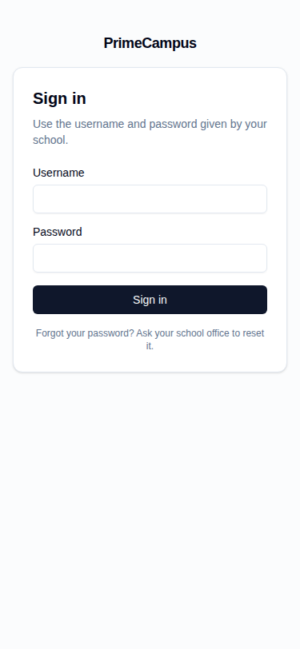
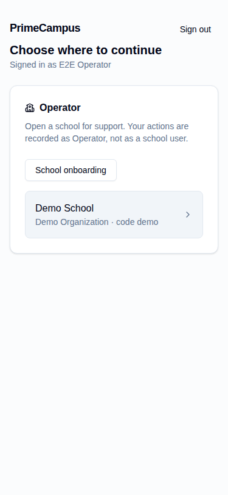
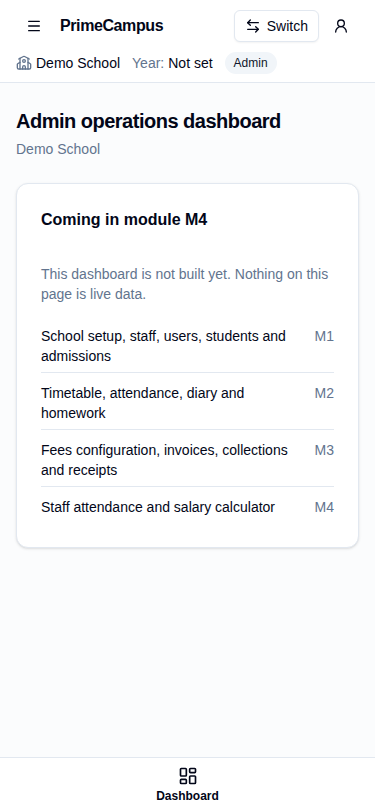
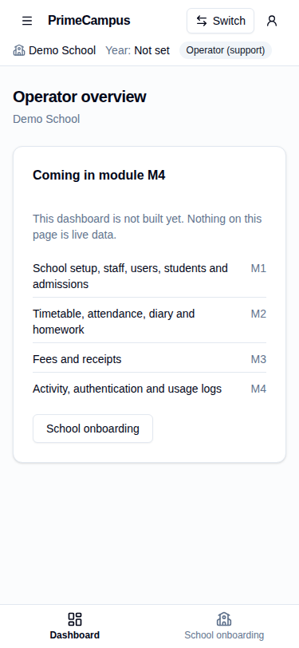
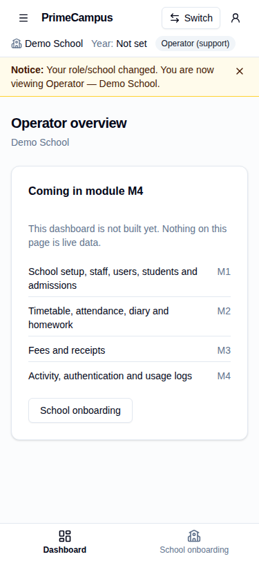

# M0 — Foundation: module report

Branch: `module/m0-foundation` · Date: 5 Oct 2026 · Brief: `docs/modules/M0.md`

## Summary

M0 is the base layer for every later module:
- Vite + React 18 + strict TypeScript app.
- Typed RPC layer that covers every browser-callable function in `public`.
- Auth / forced password change / context chooser.
- Capability-driven app shell with placeholder dashboards.
- Shared state and money/date components.
- Operator onboarding (create school + first Admin).
- Telemetry batching and Cloudflare deploy config.

All four required commands pass. There are 132 unit tests. The live Playwright suite (6 tests) passed against the live Supabase project twice in a row, using the Demo School only. No M1+ feature pages were built.

## "Done when" checklist

| # | Item | Status | How it was verified |
|---|---|---|---|
| 1 | `npm run typecheck`, `lint`, `test`, `build` all pass | ✅ | Ran all four on the final commit. `lint` = ESLint (0 warnings allowed) + `prettier --check`. `test` = 9 files / **132 tests passed**. `build` = `tsc -b && vite build`. |
| 2a | Unit tests: money helpers | ✅ | `tests/unit/money.test.ts`. Covers ₹0.05 → 5 paise, `1,00,000.50` → 10000050, `₹`/`Rs.` prefixes, float-trap inputs (0.29, 1.13, 4.35), negatives (rejected unless allowed), zero rules, invalid input (`1.234`, `1e5`, `.5`, `1,0`, `NaN`, `1 000`…), the safe-integer limit, round trips, and en-IN formatting (`₹1,23,45,678.90`, `-₹500.00`). |
| 2b | Unit tests: date helpers | ✅ | `tests/unit/dates.test.ts`. IST midnight: 18:30Z is the next school day and 18:29:59Z is not. Also checks a case where `toISOString()` gives the wrong day, year end, leap days, invalid dates, add/compare/monthStart, and display formats with no day shift. |
| 2c | Unit tests: error mapping (every hint code) | ✅ | `tests/unit/errors.test.ts` tests each of `UNAUTHENTICATED`, `FORBIDDEN`, `STALE_CONTEXT`, `VALIDATION_ERROR`, `CONFLICT`, `DUPLICATE`, `LIMIT_REACHED`, `NOT_FOUND` and `TEMPORARILY_UNAVAILABLE` (`it.each`). Also covers: SQL text is never shown (raw `23505` → "Something went wrong." + request id), unknown hints are ignored, expired JWT → UNAUTHENTICATED, fetch failure → NETWORK, abort → CANCELLED, Edge `code` mapping, global handler routing, and retry policy. `tests/unit/rpc.test.ts` adds **op_create_school → `VALIDATION_ERROR` with the server text (migration 1700)** and `DUPLICATE`. |
| 2d | Unit tests: operation id stability | ✅ | `tests/unit/operation.test.tsx`: the id is stable across re-renders, changes only after `reset()`, and is unique per form. |
| 2e | Unit tests: context-switch cache clearing | ✅ | `tests/unit/session.test.ts` › "context switch cancels in-flight requests, clears the cache and broadcasts the new revision": the in-flight RPC rejects `CANCELLED`, the query cache is empty, the epoch bumps (UI remounts and drafts are dropped), and `{type:'context'}` reaches another BroadcastChannel. The same file also covers logout, cross-tab logout, a stale context, generic sign-in errors and must-change-password gating. |
| 3.1 | Playwright: Operator logs in → creates Demo School if missing → provisions `demo.admin` → sees temp password once | ✅ live | `tests/e2e/m0.spec.ts` test 1. The first successful run created the school and provisioned `demo.admin`. Later runs hit `DUPLICATE` and use `op_find_account` + Edge `reset_password`, as instructed. After the dialog closes, the test checks the password is in neither the DOM, `localStorage`, `sessionStorage` nor the URL. The live DB confirms `demo.admin` has 1 × `account_provisioned` and 4 × `password_reset`, and Demo School is the only school. |
| 3.2 | `demo.admin` logs in with temp password → forced to change password → lands on Admin shell | ✅ live | Test 2: `/dashboard`, `/choose` and `/operator/onboarding` all bounce back to `/change-password`. After the change, the user lands on `dashboard-admin` with "Demo School" and "Admin" in the header. A reload keeps the session. |
| 3.3 | Wrong password shows a generic error; nothing about whether the user exists | ✅ live | Test 3: an existing user (`demo.admin`) and a non-existent user get the identical text "The username or password is incorrect." No "not found/exist" wording appears and the `@login.` alias is never in the page. Unit test: malformed usernames get the same message without calling Auth. |
| 3.4 | Logout in tab A logs out tab B | ✅ live | Test 4: two tabs share one session in Demo School. Signing out in A moves B to `/sign-in` within 10 s, and B can't reach `/dashboard` afterwards. Mechanisms: our BroadcastChannel `logout` message, plus auth-js `SIGNED_OUT`. |
| 4a | Network check: no request reads a table directly | ✅ live | Test 6 runs over every Supabase request from tests 1–5. Every `/rest/v1/` URL is `/rest/v1/rpc/<fn>`, and the only hosts/paths contacted are `auth/v1`, `rest/v1/rpc` and `functions/v1/accounts`. Statically, an ESLint rule bans `supabase.from(…)`, and components can't import the Supabase client. |
| 4b | No secret key in the built bundle | ✅ (approved replacement) | `npm run check:bundle` passes: 18 files, no `sb_secret_…` key values, no service-role JWT, no `service_role`, no `__pcE2E` test hooks, no source maps. The literal `grep -r "sb_secret" dist` from the brief **can never be empty**: supabase-js itself contains `e.startsWith("sb_secret_")` (key-format detection). The owner approved this replacement. Sanity check: the e2e build (`dist-e2e`) correctly **fails** `check:bundle`. |
| 5a | Context revision is sent on every school RPC | ✅ | Unit: `rpc.test.ts` calls **all 81** school wrappers and asserts `p_ctx_rev` on each, and asserts it is absent on the 12 context-free RPCs (exactly CLAUDE.md rule 2's exceptions). Live: test 6 asserts `p_ctx_rev` in the request body of every school RPC captured. |
| 5b | A forced stale revision shows the "role/school changed" message and recovers | ✅ live | Test 5: in the Operator → Demo School context, the client revision is forced to `rev-1` (e2e-only hook) and a real `get_setup_snapshot` is fired. The request body carries the stale `p_ctx_rev`, and the server answers `STALE_CONTEXT`. The banner then reads "Your role/school changed. You are now viewing Operator — Demo School." The client adopts the server's revision, and the next school RPC returns `ok`. The same path is covered by a unit test. |
| 6 | 375px screenshots of sign-in, chooser and shell | ✅ | Captured by the live suite (viewport 375×812), listed below. |

### Screenshots (375 px, live backend)

| Sign-in | Chooser (Operator) | Admin shell | Operator shell | Stale-context notice |
|---|---|---|---|---|
|  |  |  |  |  |

No parent/child-card or multi-role chooser screenshot exists: Demo School has no parent or multi-role accounts yet (they are M1 data). Child cards are covered by `session.test.ts` (`automaticChoice`) only. See Known gaps.

## What was built (by brief section)

1. **Scaffold**
   - Vite 8, React 18.3, TS 6 strict (`noUncheckedIndexedAccess`), Tailwind v4, and shadcn/ui primitives (Button, Input, Label, Form, Dialog, DropdownMenu, Select, Table, Sonner, Skeleton, Badge, Card, Sheet).
   - React Router 7 data router with lazy routes, TanStack Query 5, RHF + Zod 4, supabase-js 2, Vitest + RTL, Playwright 1.56, ESLint + Prettier.
   - Scripts: `dev build preview typecheck lint test test:e2e`, plus `gen:rpc`, `check:bundle` and `format`. `.env.example` has the three public values.
2. **`src/lib`**
   - **Supabase client:** `supabase.ts` — the single client, publishable key only.
   - **RPC layer:** `rpc/` — `functions.ts` is generated by `scripts/gen-rpc-wrappers.mjs` from `src/generated/database.types.ts`, with **93 wrappers** (81 school + 12 context-free). The 9 `svc_*` functions are service-role only and get no wrapper. `client.ts` injects `p_ctx_rev`, aborts on context switch, drops late responses from an old epoch, maps errors, and validates responses with zod where `src/contracts/rpc-results.ts` declares a schema.
   - **Errors:** `errors.ts` — `AppError {code, message, requestId}` plus global UNAUTHENTICATED / STALE_CONTEXT handlers.
   - **Idempotency:** `operation.ts` — `useOperationId()`.
   - **Money and dates:** `money.ts` and `dates.ts`.
   - **Edge caller:** `edge.ts` — `accounts` Edge caller typed per action.
   - **Session state:** `session/` — the plain-module store with `useSyncExternalStore`, plus the session lifecycle.
   - **Telemetry and cache:** `telemetry.ts`, and `query-client.ts` (memory-only, reviewed defaults).
3. **Auth & context**
   - Sign-in uses the username alias, then `bootstrap_account`. The forced change-password screen is the only reachable route.
   - Chooser: role cards, parent child cards, and the Operator school picker (`op_list_schools`, migration 1600).
   - Single-context users enter directly. A page reload resumes the server-held context.
   - Switch/logout cancels queries, clears the cache, remounts routes (drafts discarded) and broadcasts to other tabs. Logout runs `end_app_session` → `signOut({scope:'local'})`.
4. **App shell**
   - The header always shows school, academic year, role and child.
   - Switch link and user menu (change password, sign out).
   - Sidebar on desktop, bottom nav + sheet on phones.
   - Navigation comes from `capabilities` and context fields, never from role names. Upcoming areas are plain text marked "in M1…M4", not clickable.
   - Per-role placeholder dashboards say "Coming in module Mx" according to the owner's module map.
5. **Shared components**: `DataState` (loading / empty / error with request id / forbidden / offline), `MoneyInput`, `MoneyText` (missing → "—", never ₹0), `DateInput`, `ConfirmDialog`, `OneTimeSecretDialog` (copy button, cleared on close, not held in any query/mutation cache), `PageHeader`, `ErrorText`.
6. **Operator onboarding** (`/operator/onboarding`)
   - Create school runs `op_create_school` with a new or existing organization.
   - The first Admin is created with Edge `provision`. Its operation id is reused on retry and reset after success.
   - On `DUPLICATE`, "Issue a new temporary password" runs `op_find_account` → `reset_password`.
7. **Telemetry**: `record_telemetry` page views, at most 20 per batch, flushed every 60 s and on `visibilitychange`/`pagehide`. Paths are stripped of ids. It is best effort and never blocks the UI (`telemetry.test.ts`).
8. **Deploy config**: `wrangler.jsonc` (static assets from `./dist`, `not_found_handling: single-page-application`) and `public/_headers` (CSP, nosniff, frame-deny, cache rules). **Not deployed.**

## Bugs found and fixed during verification

- **Sign-in error never appeared.** Sign-in bumped the UI epoch, which remounted the form and erased its error. Fixed so sign-in only clears the cache. Found by Playwright.
- **Operator left on a blank `/dashboard`.** After sign-in, the page called `navigate('/dashboard')` while the route gate redirected to `/choose`. Fixed: post-action navigation now goes through `homeFor(status)`.
- **React 18 vs shadcn v4 refs.** The v4 registry assumes React 19, where `ref` is an ordinary prop. On React 18, `Button`, `Input` and `SelectTrigger` silently dropped refs. As a result, the account dropdown was never positioned (it rendered off-screen and sign-out was unclickable), and React Hook Form couldn't focus invalid fields. Fixed with `forwardRef`; regression test in `tests/unit/ui-refs.test.tsx`. **Later modules adding shadcn components must forwardRef any component that is used under `asChild` or `FormControl`.**
- **Duplicate notice covered the header.** The stale-context notice appeared as both a toast and a banner, and the toast hid the context header. Now there is one persistent banner in the shell, and a toast only on the chooser.

## Decisions (owner-approved)

- `check:bundle` replaces the literal `grep sb_secret` check (see item 4b).
- The stale-context e2e hook (`src/app/e2e-hooks.ts`, `window.__pcE2E`) is only bundled when `VITE_E2E_HOOKS=1`. Playwright builds it into `dist-e2e`, never into `dist`, and `check:bundle` enforces this.
- React Router is pinned to 7: v8 requires React 19, and CLAUDE.md fixes React 18.

## Spec / backend notes

- **op_create_school validation:** migration `20261005001700` makes a bad organization code return `VALIDATION_ERROR`. No client workaround existed to remove. The form still pre-validates the organization and school code patterns, which is ordinary input validation. The server message is shown as-is when it does return `VALIDATION_ERROR` (unit-tested).
- **Types:** `src/generated/database.types.ts` was regenerated after 1600/1700 via the Supabase MCP (no `SUPABASE_ACCESS_TOKEN` here) and is byte-identical. 1700 changed no signatures.
- **Docs moved:** the PRD, TRD and DB schema were moved with `git mv` from `docs/modules/` to `docs/` so the paths in CLAUDE.md are correct.

## Known gaps / not verified

- **Parent/child and multi-role chooser:** not verified live; no such accounts exist in Demo School before M1. Covered by unit tests only.
- **`must_change_password` re-login fallback:** if Auth revokes the session during a password change, `changePassword` signs in again with the new password. Live runs never needed this path (the session survived), so it is **not verified live**.
- **CSP (`public/_headers`) and the SPA fallback:** **not verified on Cloudflare**; nothing was deployed. `vite preview` doesn't apply `_headers`.
- **Bundle size:** initial JS is **~206 KB gzipped**, inside the TRD §19 budget of ≤300 KB. Vite's raw-size warning limit was raised to 900 KB with a comment. Splitting vendors (supabase-js, zod) into separate chunks is a later optimisation.
- **Request id:** for RPC errors it is generated client-side, because PostgREST errors don't expose a server request id to supabase-js. Edge errors show the function's own `request_id`.
- **Container-only setup for E2E:** the cloud container needed the egress proxy's CA added to Chromium's NSS store (`libnss3-tools`), plus a Playwright proxy setting (`playwright.config.ts` reads `HTTPS_PROXY`). Normal machines and CI don't need the CA step.
- **E2E accounts:** E2E needs `E2E_OPERATOR_USERNAME` / `E2E_OPERATOR_PASSWORD` in the environment. Each run resets `demo.admin`'s password, and the new one exists only in test memory.

## How to run

```bash
cp .env.example .env.local
npm ci
npm run typecheck && npm run lint && npm test && npm run build && npm run check:bundle
E2E_OPERATOR_USERNAME=… E2E_OPERATOR_PASSWORD=… npm run test:e2e   # live project, Demo School only
npm run gen:rpc   # after regenerating src/generated/database.types.ts
```

## Dependencies

All of these come from the TRD §3 stack or are required by shadcn/ui:
- **Runtime:** react 18, react-dom, react-router 7, @tanstack/react-query, react-hook-form, zod, @hookform/resolvers, @supabase/supabase-js.
- **shadcn/ui runtime:** radix-ui, class-variance-authority, clsx, tailwind-merge, lucide-react, sonner.
- **Dev:** vite, @vitejs/plugin-react, tailwindcss + @tailwindcss/vite, typescript, vitest, jsdom, @testing-library/{react,jest-dom,user-event}, @playwright/test (pinned 1.56 to match the pre-installed Chromium), eslint + typescript-eslint + react-hooks/react-refresh plugins + globals, prettier + prettier-plugin-tailwindcss, @types/*.

There are **no other new dependencies**. `next-themes`, which shadcn's Sonner wrapper imports, was removed instead of added. `wrangler` is not installed; it's only needed at deploy time.

## Files

- **Config:** `package.json`, `package-lock.json`, `vite.config.ts`, `tsconfig*.json`, `eslint.config.js`, `.prettierrc.json`, `.prettierignore`, `.gitignore`, `.env.example`, `components.json`, `playwright.config.ts`, `wrangler.jsonc`, `index.html`, `public/_headers`, `public/favicon.svg`.
- **Scripts:** `scripts/gen-rpc-wrappers.mjs`, `scripts/check-bundle.mjs`.
- **`src/app`:** `App.tsx`, `router.tsx`, `gate.ts`, `navigation.ts`, `e2e-hooks.ts`, `RouteError.tsx`, `NotFoundPage.tsx`, `layouts/RootLayout.tsx`, `layouts/AppShell.tsx`.
- **`src/components`:** `ui/*` (13 shadcn primitives; Button, Input and Select patched for forwardRef) and `shared/*` (8 components).
- **`src/contracts`:** `capabilities.ts`, `roles.ts`, `session.ts`, `rpc-results.ts`, `query-keys.ts`.
- **`src/features`:** `auth/{SignInPage, ChangePasswordPage, ContextChooserPage, AuthCard}.tsx`, `dashboard/DashboardPage.tsx`, `operator/{OnboardingPage.tsx, hooks.ts}`.
- **`src/lib`:** `supabase.ts`, `env.ts`, `errors.ts`, `money.ts`, `dates.ts`, `operation.ts`, `edge.ts`, `device.ts`, `telemetry.ts`, `query-client.ts`, `utils.ts`, `rpc/{client,functions,index}.ts`, `session/{store,session}.ts`.
- **`src/generated`:** `database.types.ts`. Also `src/main.tsx`, `src/index.css`, `src/vite-env.d.ts`.
- **Tests:** `tests/unit/*` (9 files + `fake-supabase.ts`, `setup.ts`), `tests/e2e/m0.spec.ts`, `tests/e2e/globals.d.ts`.
- **Docs:** `docs/PrimeCampus_{PRD,TRD,DB_Schema}.md` (moved), `docs/reports/M0.md`, `docs/reports/m0-screens/*.png`.
